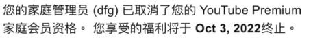

---
__售后文档 :)__

## 使用说明

::: danger 必看
不要看到这么多文字都觉得很烦,你可以直接使用顶部搜索框,搜索你想要了解的内容,可以直接输入关键字哦,我所知道的都在这里面了哟~:tada: :tada: :tada: :tada: 
:::

# YouTube售后文档

---
::: danger 必看 
付款后所有要知道的都在这里
:::

## 收到邮件通知
### 您的YouTube Premium家庭会员资格已被取消

> 仔细查看邮件的内容,查看是否有指定时间
- 这只是店家取消了自动续费功能
- 由于使用了自动发货系统,自动发货系统会在到期日自动续费
- 所以关闭了YouTube内置的自动续费功能

## 到期时间

- 请您放心使用,由于采用的自动发货系统,会根据你的激活码识别你的购买时间,系统会在将要到期或者到期日当天进行续费.

## 看到广告

- 说明您当前位置不在支持YouTube Premium的范围(包含使用网络节点)[查看支持国家\地区](../../guide/youtube/use.md#支持youtube的国家和地区)

## 获取更多使用文档

> - 请发邮件给我  [邮件联系我](mailto:admin@htrsy.top)

## 到期保留

::: tip 提示

- # 注意：一年只能加入一个家庭组!

:::

> - 由于一年只能加入一个家庭组,后台系统会将您的信息和家庭组保留3天.
> - 3天内续费,可以继续使用原有家庭组.
> - 如遇到紧急情况,请[邮件联系我](mailto:admin@htrsy.top)可申请一次延长保留
> - **如果超出3天,后台系统会将您从家庭组内踢出**.

## 获取更多使用文档

> - 请发邮件给我  [邮件联系我](mailto:admin@htrsy.top)