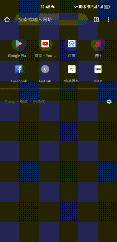
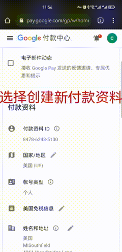
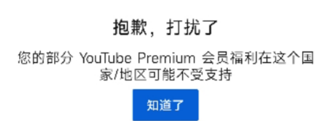

---
__售前文档 :)__

## 使用说明
::: danger 必看
不要看到这么多文字都觉得很烦,你可以直接使用顶部搜索框,搜索你想要了解的内容,可以直接输入关键字哦,我所知道的都在这里面了哟~:tada: :tada: :tada: :tada: 
:::

- __[购买账号](https://ka.htrsy.top/)__ - 快速获得一个Google账号,开启YouTube！

开始之前请确保您已成年!

---

# YouTube售前文档

---

::: danger 必看 
付款前所有要知道的都在这里
:::

## 版本区别

> - 由于购买的是家庭组方案  

> - 月付,季付,半年付,年付等等实际到账会员时间会相差几天  

> - 这是由于家庭组成员由5人组成,并不能确定5个人是同一天进入!

## 付款前所需资料

> - 地区!地区!地区!: :wink: 
> - 不知道地区你就无法进组 :cry: 
> - :laughing: 让我们开始吧 :yum:
>
> - 如果你不是新手,那么你完全可以跳过 :-) :-( 8-) ;)

## 注册账号

### 选择Google账号类型

<Badge type="tip" text="个人账号" vertical="top" />

<Badge type="tip" text="企业账号" vertical="top" />

1. __转到 [Google 帐号登录页面](https://accounts.google.com/)__

2. 点击**创建帐号**

3. 输入您的名字

4. 在“用户名”字段中，输入用户名

5. 输入并确认您的密码

- **提示**：当您在移动设备上输入密码时，第一个字母不区分大小写

6. 点击下一步

- 可选：为您的帐号添加电话号码并进行验证

#### 使用现有的电子邮箱地址注册

1. __转到 [Google 帐号登录页面](https://accounts.google.com/)__

2. 点击**创建帐号**

3. 输入您的名字

4. 点击**改用我的当前电子邮件地址**

5. 输入您的当前电子邮件地址

6. 点击**下一步**

7. 使用向您的现有电子邮件地址发送的验证码验证该地址

8. 点击**验证**

> - 如果显示手机号不能用于验证,或者无法注册[快速获得一个Google账号](https://ka.htrsy.top)

## 查看地区
### __标准验证地区 :speech_balloon:__

__文字步骤 :)__

- __[验证你的地区](https://pay.google.com/gp/w/home/settings)__ - 快速检索你有没有锁区

- 如果如图一样,显示你有付款资料 确定`国家/地区`,这就是你`可以加入家庭组的地区`

### __快速验证地区 :zap:__

- 如果你没有在Google相关生态,如YouTube,Google play等付过费或者绑定付款资料以及加入过家庭组,可以选择此项教程.

1. 选择**香港**或者**美国**节点

- 提示: 如何使用节点,请查看网络相关教程[网络服务](../../posts/proxy.md)

2. __打开 [GooglePlay](https://play.google.com/)__

3. 如果显示和你使用节点一致的位置,那说明您的账号默认没有锁区

::: warning
- 这是一个警告!

- # 注意：如果你不确定你的账号是否有过付款记录,请使用标准验证方式  8-) 

:::

---
## 修改地区

### 来自Google官方文档 :house:

1.在 Android 设备上，打开 Google Play 商店应用

2.点按右上角的个人资料图标

3.依次点按**设置****常规****帐号和设备偏好设置****国家/地区和个人资料**。

4.点按您想要添加帐号的国家/地区

5.按照屏幕上的说明为该国家/地区添加付款方式

- 提示：您的个人资料最多可能需要 48 小时才能更新

### 非官方文档 :rainbow:
__演示 :)__

__文字步骤 :)__

1. 登录[设置](https://pay.google.com/#settings)

2.如果您有多个个人资料:   

&ensp;a.在左上角您的姓名旁边，点击向下  

&ensp;b.选择您要编辑的配置文件  

3.进行编辑。您可以更改地址和付款方式等信息  

- **提示**:       __[信息生成器](https://www.meiguodizhi.com/)__

4.保存您的编辑

#### 关闭付款资料

1.**可选**：如果您有多个个人资料，请访问[GooglePlay](https://pay.google.com)并确保您已登录要关闭的个人资料  

2.转到[GooglePlay](https://pay.google.com)**设置**  

3.在`付款资料状态`下，选择**关闭付款资料**  

4.按照屏幕上的说明进行操作

---

## 选择地区

::: warning
- 这是一个警告!

- # 注意：家庭方案目前尚未在白俄罗斯、冰岛、以色列、斯洛文尼亚、韩国和委内瑞拉推出。

:::

---

- 地区是YouTube相关内容的重中之重!

- 主推 `香港`和`美国`

- YouTube根据地区,推送相关内容

- 请选择主流地区!

## 获取更多使用文档

> - 请发邮件给我  [邮件联系我](mailto:admin@htrsy.top)

