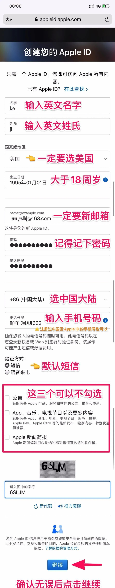
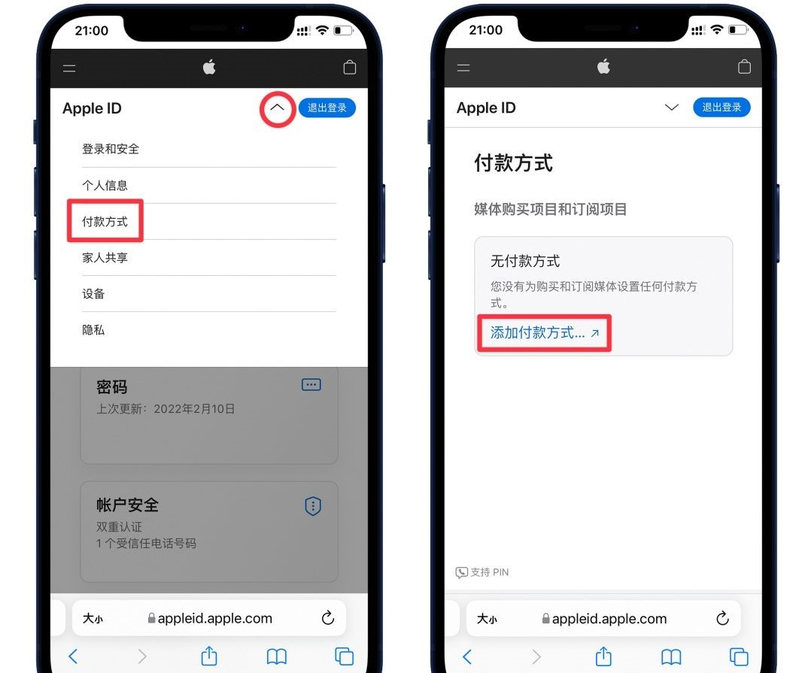
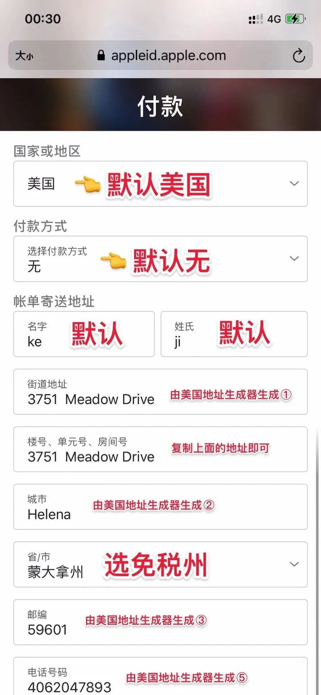
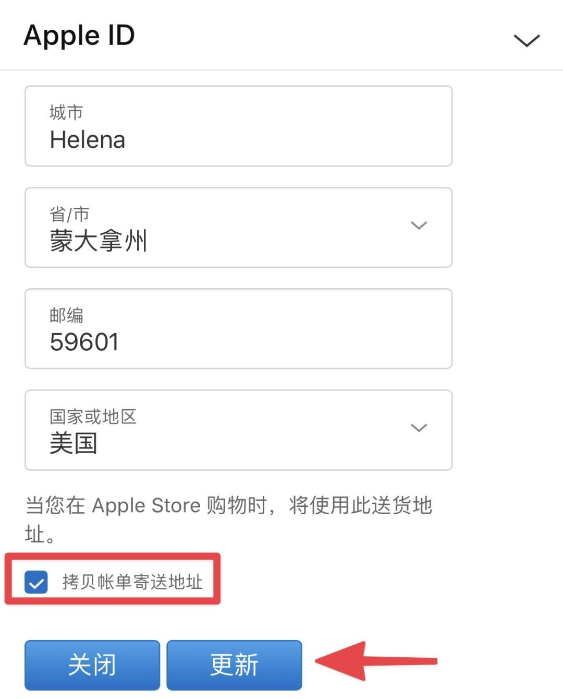
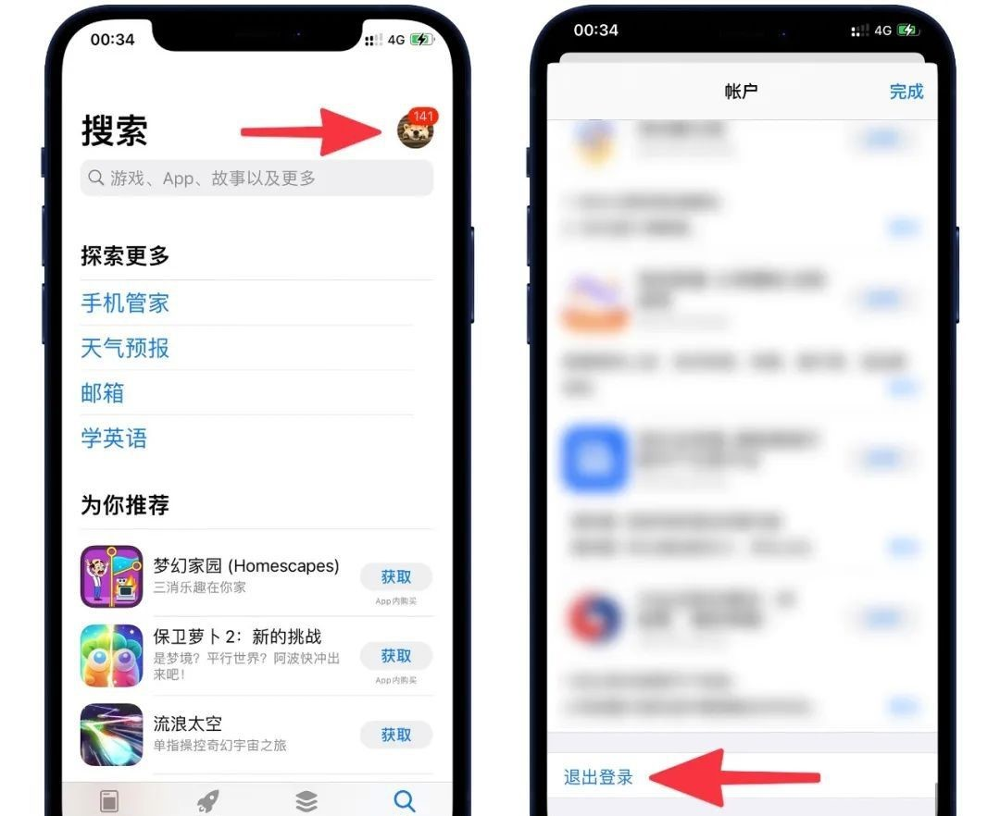
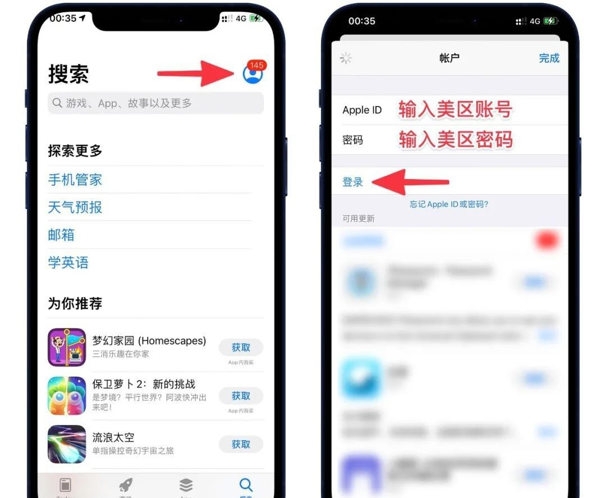
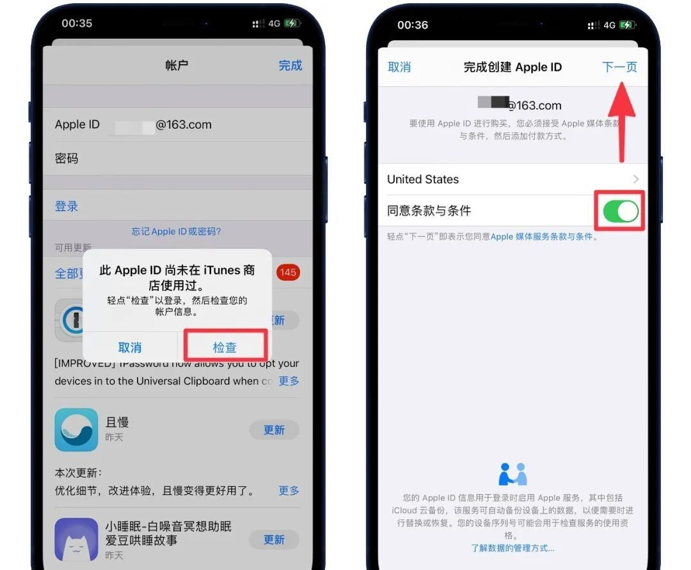
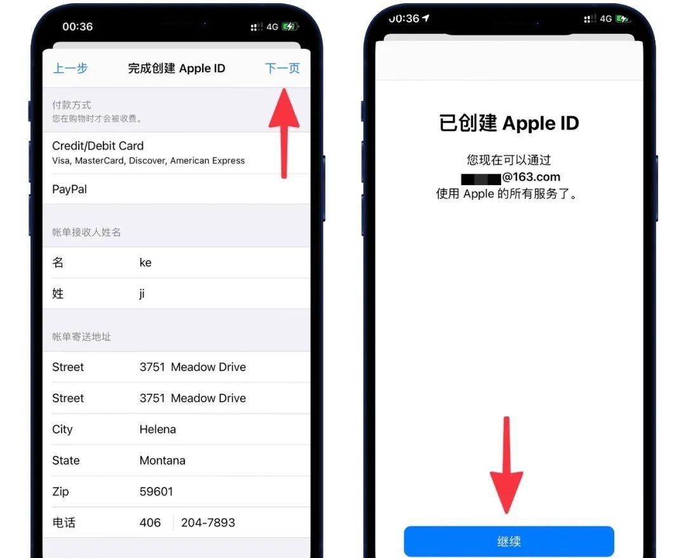
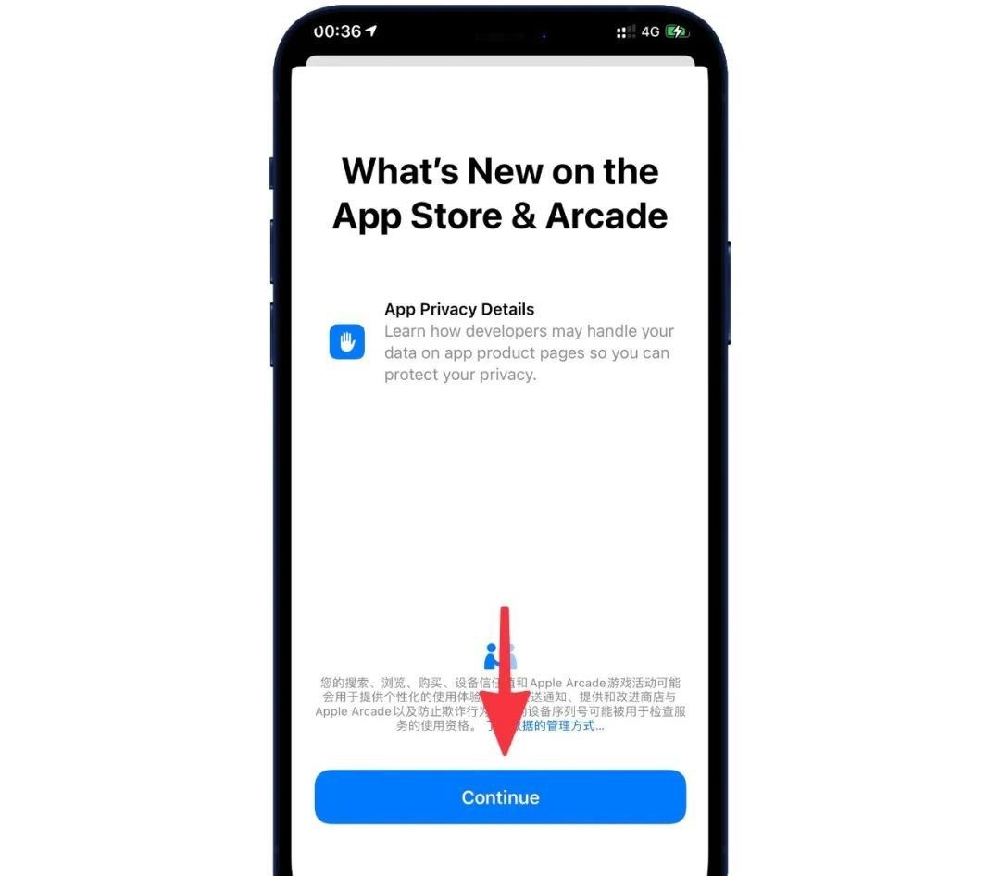

# 网络工具

## Android

|        工具名         |               下载地址               |
| :-------------------: | :----------------------------------: |
|     SagerNet(SSR)     | https://wwz.lanzouy.com/ixbp50bgrbub |
|      Ssrray(SSR)      | https://wwz.lanzouy.com/iM5gg0bgrc7e |
| **Shadowsocksr(SSR)** | https://wwz.lanzouy.com/i3dCy0bgrc9g |
|  **Shadowsocks(SS)**  | https://wwz.lanzouy.com/idZMH0bgrm3a |
|   **Clash(v2ray)**    | https://wwz.lanzouy.com/iBkUw0bgrskd |
|  **v2rayNG(v2ray)**   | https://wwz.lanzouy.com/iebJ00bgrt9i |


## Mac

|        工具名         |               下载地址               |
| :-------------------: | :----------------------------------: |
| **ShadowsocksX(SSR)** | https://wwz.lanzouy.com/ibYfk0bgrd1e |
|  **Shadowsocks(SS)**  | https://wwz.lanzouy.com/in9AH0bgrmbi |
|   **ClashX(v2ray)**   | https://wwz.lanzouy.com/iBB2z0bgs6he |
|      **Qv2ray**       | https://wwz.lanzouy.com/iwxO00bgs77a |
|   **V2rayU-arm64**    | https://wwz.lanzouy.com/irD750bgs7oh |
|        V2rayU         | https://wwz.lanzouy.com/islpq0bgs8rg |
|        V2rayX         | https://wwz.lanzouy.com/idPAn0bgs98d |


## Windows

|        工具名         |               下载地址               |
| :-------------------: | :----------------------------------: |
| **ShadowsocksX(SSR)** | https://wwz.lanzouy.com/iJeZq0bgrcna |
|  **Shadowsocks(SS)**  | https://wwz.lanzouy.com/iX5v10bgrmgd |
|      **V2rayN**       | https://wwz.lanzouy.com/i5JZT0bgsjdi |
|      **Qv2ray**       | https://wwz.lanzouy.com/iopPS0bgsmkd |
|         Netch         | https://wwz.lanzouy.com/inMtL0bgsnsh |
|         **Clash**         | https://wwz.lanzouy.com/iOAEM0bgsoje |

## iPhone

> iPhone需要外区账号

### 注册外区账号

>打开Apple Id官网
```apple
https://appleid.apple.com/account 
```

- 注册成功后会自己登录
- 接着点击退出登录左边的“箭头”然后点击付款方式，接着再点击添加付款方式


- 添加付款方式&账单地址，这步很关键，需要借助[美国地址生成器](https://www.meiguodizhi.com/usa-address/alaska)，它会自动帮你生成街道地址、城市、邮编、电话号码等信息
> - 建议选以下五个免税州:
&ensp;蒙大拿州(Montana)  
&ensp;俄勒冈州(Oregon)  
&ensp;阿拉斯加州(Alaska)  
&ensp;特拉华州(Delaware)  
&ensp;新罕布什尔(New Hampshire)  





> - 到这里就注册成功了

### 登录美区账号

> - 打开 App Store，首先退出当前账号。点击右上角的头像，然后拉到末尾，点击退出登录即可


> - 接着再次点击 App Store 中右上角的头像，输入前面注册的美区账号&密码，点击登录即可


> - 然后会跳出一个弹窗，选择检查即可，接着打开同意条款与条件，选择下一页


> - 不要修改任何内容，直接点击下一页，然后点击继续


> - 点击Continue，到这里我们的美区 Apple ID 就已经成功登录了



::: tip 注意
- 不要在**设置**中登录美区Apple ID，以免造成不必要的麻烦。下载美区 App 只需在 **App Store**中登录即可，下载完后再换回国区账号即可，对 iCloud 等不会有任何影响  
  

- 建议不要把美区 Apple ID 当成主力账号，需要下美区应用时登录就行了，以免出现啥问题
:::

### 美区ID常见问题

1.&ensp;手机号码提示错误怎么解决？  

&ensp;看看复制的号码是不是开头有数字"1"或者"+1"，有的话去掉即可  

2.&ensp;更新 App 的时候显示账号被锁定，但可以下载未下载过的 App 是什么原因？  
&ensp;因为你更新的这个 App 之前是用其他 Apple ID 下载的，所以这个 App是和你之前下载时的那个 Apple ID 绑定在一起的，所以出现被锁定的提示是原先账号出了问题，和当前账号没关系。解决方法很简单，把 App 卸载重新安装即可  
    
3.&ensp;Your request could not be completed at this time   
&ensp;应该是地址生成器生成的号码有问题，电话是 xxx-xxx-xxx 的正常，而 +1xxx-xxx-xxx 就不行。解决方法就是去掉号码开头的"1"或者"+1"即可  

4.&ensp;Cannot be created at this time  
&ensp;切换成 4G、5G、或者换个浏览器、或者用电脑注册，或者次日再试试  


5.&ensp;如何充值  
&ensp; 绑定外币信用卡,如:MasterCard&ensp;VISA&ensp;运通  

6.&ensp;没有信用卡怎么充值?  
&ensp;TB或者PDD购买 Apple美区充值卡  

> - 其他问题请自行百度,已收录的只有这么多!
### TB或者PDD购买

> 不是很建议,购买的账号不安全,主要看您自己
> 在这里不推荐店铺了,可以自行搜索